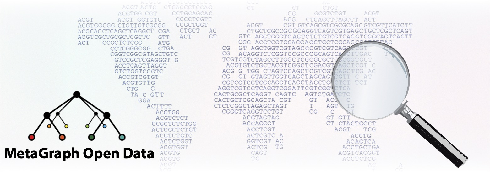

# MetaGraph Sequence Indexes


## Overview 
The MetaGraph Sequence Index dataset offers full-text searchable index files for raw sequencing data hosted in major public repositories. These include the European Nucleotide Archive (ENA) managed by the European Bioinformatics Institute (EMBL-EBI), the Sequence Read Archive (SRA) maintained by the National Center for Biotechnology Information (NCBI), and the DNA Data Bank of Japan (DDBJ) Sequence Read Archive (DRA). 
Currently, the index supports searches across more than 10 million individual samples, with this number steadily increasing as indexing efforts continue.

## Data

### Summary
Following the principle of phylogenetic compression, we have hierarchically clustered all samples using information from their biological taxonomy (as far as available). As a result, we currently have a pool of approximately 5,000 individual index chunks. Each of these chunks contains the information of a subset of the samples. Every chunk is assigned into one taxonomic categories. Overall, there are approx 200 taxonomic categories available, each containing only a few up to over 1,000 individual index chunks. The number of chunks within the same category is mostly driven by the number of samples available from that taxonomic group. The chunk size is limited for practical reasons, to allow for parallel construction and querying.

### Available categories
Individual categories were formed by grouping phylogenetically similar samples together. This grouping started at the species level of the taxonomic tree. If too few samples were available to form a chunk, the taxonomic parent was selected for aggregation for samples. The resulting list of categories is available [here]().

### Dataset layout
All data is available under the following root: s3://metagraph-data-public/all_sra

```
s3://metagraph-data-public/all_sra
+-- data
|   +-- category_A
|   |   +-- chunk_1
|   |   +-- ...
|   +-- ...
+-- metadata
    +-- category_A
    |   +-- chunk_1
    |   +-- ...
    +-- ...
```
Where `category_A` would be one of the [Available categories](#available-categories) mentioned above. Likewise, `chunk_1` would be replaced with a running number of the chunk, padded with zeros up to a total length of 4. 

As an example, to reach the data for the 10th chunk of the `metagenome` category, the resulting path would be `s3://metagraph-data-public/all_sra/data/metagenome/0010/`.


### Chunk structure
Irrespective of whether you are in the `data` or the `metadata` branch, each chunk contains a standardized set of files. 

In the `data` branch one chunk contains:
```
annotation.clean.row_diff_brwt.annodbg
annotation.clean.row_diff_brwt.annodbg.md5
graph.primary.small.dbg
graph.primary.small.dbg.md5
```

Both files ending with `dbg` are needed for a full-text query. They form the MetaGraph index. The files ending in `md5` are check sums to verify correct transfer of data in case you download it.

In the `metadata` branch one chunk contains:
```
metadata.tsv.gz
```
This is a gzip-compress, human readable text file containing additional information about the samples that are contained within each index chunk.

## Usage within AWS
The following steps describe how to set up a search query across all or a subset of available index files.

### Configure the `aws` CLI tool

Please refer to the [AWS docs](https://docs.aws.amazon.com/cli/latest/userguide/cli-chap-getting-started.html) for the installation instructions and prerequisites:

1. [Setup AWS account and credentials](https://docs.aws.amazon.com/cli/latest/userguide/getting-started-prereqs.html);
2. [Install `aws` CLI](https://docs.aws.amazon.com/cli/latest/userguide/getting-started-install.html);
3. [Setup credentials](https://docs.aws.amazon.com/cli/latest/userguide/getting-started-quickstart.html).


For the third step, we recommend using authentication via [IAM Identity Center](https://docs.aws.amazon.com/cli/latest/userguide/cli-configure-sso.html#sso-configure-profile-token-auto-sso):

```sh
aws configure sso
```

You can find SSO Start URL in your AWS access portal. **Make sure to select `default` when prompted for profile name.**

Alternatively, you can setup credentials via environmental variables:

```sh
export AWS_ACCESS_KEY_ID="..."
export AWS_SECRET_ACCESS_KEY="..."
export AWS_SESSION_TOKEN="..."
```

or via `~/.aws/credentials`:

```sh
[default]
aws_access_key_id=...
aws_secret_access_key=...
aws_session_token=...
```

You can find specific tokens and keys in "Access keys" section of your AWS access portal after signing in.

### Clone the project

```sh
git clone https://github.com/ratschlab/metagraph-open-data.git
cd metagraph-open-data
```

### Deploy the Cloud Formation template

**We assume that you work in `eu-central-2` region, and your `aws` authentication is configured in the `default` profile.**

 The [deployment script](https://github.com/ratschlab/metagraph-open-data/blob/main/scripts/deploy-metagraph.sh) will setup the following on your AWS using the [CloudFormation template](https://github.com/ratschlab/metagraph-open-data/blob/main/metagraph-stack.yaml):

- S3 bucket to store your queries and their results;
- AWS Batch environment to execute the queries;
- Step Function and Lambdas to schedule your queries as individual Batch tasks and merge their results;
- SNS topic to send notifications to when the query is fully processed.

If you want to receive SNS notifications after a query is processed, provide your email to the script using `--email test@example.com` argument, **and confirm subscription in your mailbox**:

```sh
scripts/deploy-metagraph.sh --email test@example.com
```

If you want to use your own AMI for AWS Batch jobs (e.g. for security reasons or to support newer Metagraph features), use `--ami ami-...` to provide your AMI ID or request that it is built on your AWS with `--ami build`. **The latter uses EC2 and may take up to 30 minutes!**

### Upload your query to the s3 bucket

```sh
scripts/upload-query.sh examples/test_query.fasta
```

You can upload your own queries by providing `/path/to/query.fasta` instead of [`examples/test_query.fasta`](https://github.com/ratschlab/metagraph-open-data/blob/main/examples/test_query.fasta). You can also upload `examples/100_studies_short.fq` if you would like to test the setup on a larger query.

### Submit a job

You need to describe your query in a JSON file. A minimal job definition ([`examples/scheduler-payload.json`](https://github.com/ratschlab/metagraph-open-data/blob/main/examples/scheduler-payload.json)) looks as follows:

```json
{
    "index_prefix": "all_sra",
    "query_filename": "test_query.fasta",
    "index_filter": ".*000[1-5]$"
}
```

As of now, only datasets stored in `s3://metagraph-data-public` are supported. Generally, the arguments that you can provide are as follows:

- `index_prefix`, e.g. `all_sra` or `all_sra/data/metagenome`. Only chunks in the subdirectories of `index_prefix` will be considered for querying.
- `query_filename`, the filename of the query that you previously uploaded via `scripts/upload-query.sh`.
- `index_filter` (`.*` by default), a [re](https://docs.python.org/3/library/re.html)-compatible regular expression to filter paths to chunks on which the query is to be executed.

Additionally, you can specify the following parameters to be passed to the [Metagraph CLI](https://github.com/ratschlab/metagraph) for all queried chunks:

- `query_mode` (`labels` by default),
- `num_top_labels` (`inf` by default),
- `min_kmers_fraction_label` (`0.7` by default),
- `min_kmers_fraction_graph` (`0.0` by default).

You can submit the query for execution with the following command:

```sh
scripts/start-metagraph-job.sh examples/scheduler-payload.json
```

It will create a dedicated AWS Batch job for each queried chunk, adjusting allocated RAM to the chunk size.

#### Large query example

You can use our example JSON payload for the large query in [`examples/large-query.json`](https://github.com/ratschlab/metagraph-open-data/blob/main/examples/large-query.json):

```json
{
    "index_prefix": "all_sra",
    "query_filename": "100_studies_short.fq",
    "index_filter": ".*001[0-9]$",
    "query_mode": "matches",
    "num_top_labels": "10",
    "min_kmers_fraction_label": "0"
}
```

This will execute the following command for all chunks from `0010` to `0019`:

```sh
metagraph query -i graph.primary.small.dbg \
                -a annotation.clean.row_diff_brwt.annodbg \
                --query-mode matches \
                --num-top-labels 10 \
                --min-kmers-fraction-label 0 \
                --min-kmers-fraction-graph 0 \
                100_studies_short.fq
```

Then, it will save the resulting file in the S3. When all chunks are processed, a dedicated script will merge the results in a single file and send you a notification.

## Instructions for offline usage

MetaGraph can be [installed](https://github.com/ratschlab/metagraph#Install) locally for offline use on a Linux or a Mac host using the commands below. Search indexes can be downloaded from [`s3://metagraph-data-public`](s3://metagraph-data-public). For example, chunk `0001` can be downloaded to a working directory as follows:
```sh
aws s3 cp s3://metagraph-data-public/all_sra/data/metagenome/0001 . --recursive
```
Currently, chunks numbered `0001` through to `0400` are available for download. The example query file is located in this repository under `examples/100_studies_short.fq`.

#### Conda
```sh
conda install -c bioconda -c conda-forge metagraph
conda activate metagraph
```

Followed by a query on chunk `0001` using the command
```sh
metagraph query -i 0001/graph.primary.small.dbg \
                -a 0001/annotation.clean.row_diff_brwt.annodbg \
                --query-mode matches \
                --num-top-labels 10 \
                --min-kmers-fraction-label 0 \
                --min-kmers-fraction-graph 0 \
                examples/100_studies_short.fq
```

#### Docker
```sh
docker pull ghcr.io/ratschlab/metagraph:master
```

Followed by a query on chunk `0001` using the command
```sh
docker run -v ${MNTDIR}:/mnt ghcr.io/ratschlab/metagraph:master query -i 0001/graph.primary.small.dbg \
                                                                      -a 0001/annotation.clean.row_diff_brwt.annodbg \
                                                                      --query-mode matches \
                                                                      --num-top-labels 10 \
                                                                      --min-kmers-fraction-label 0 \
                                                                      --min-kmers-fraction-graph 0 \
                                                                      examples/100_studies_short.fq
```
replacing `${MNTDIR}` with the local mount path.

## Additional instructions

For further documentation and usage instructions (including setup instructions using Docker and via source code compilation), please refer to our [Quick start](https://metagraph.ethz.ch/static/docs/quick_start.html) guide in the [MetaGraph documentation](https://metagraph.ethz.ch/static/docs/index.html). The source code is maintained on our [GitHub repository](https://github.com/ratschlab/metagraph).
